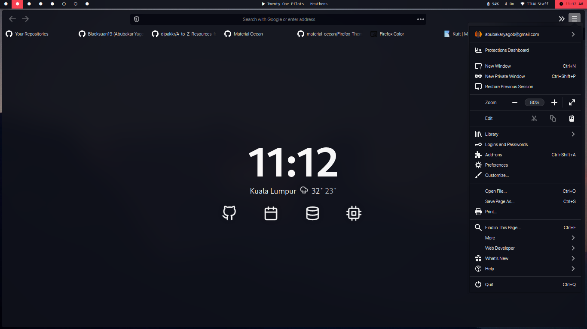

### Installation:

- Add [Firefox-Color](https://addons.mozilla.org/en-US/firefox/addon/firefox-color/) Addon to your firefox browser
- [Open the theme link](https://kutt.it/367yhv) via your browser
- Select Yup to apply the theme
- Enjoy!

### Other variations(Extensions without the need for firefox-color):

- [Material Ocean](https://addons.mozilla.org/en-US/firefox/addon/material-ocean-theme/)
- [Material Ocean accent color](https://addons.mozilla.org/en-US/firefox/addon/material-ocean-accent-color/)
- [Material Ocean color 1](https://addons.mozilla.org/en-US/firefox/addon/material-ocean-color-1/)
- [Material Ocean color 4](https://addons.mozilla.org/en-US/firefox/addon/material-ocean-color-4/)
- [Material Ocean color 5](https://addons.mozilla.org/en-US/firefox/addon/material-ocean-color-5/)
- [Material Ocean color 8](https://addons.mozilla.org/en-US/firefox/addon/material-ocean-color-8/)

### License:

Licensed Under [GNU’s GPL version 3](https://github.com/material-ocean/Material-Ocean/blob/master/LICENSE)
